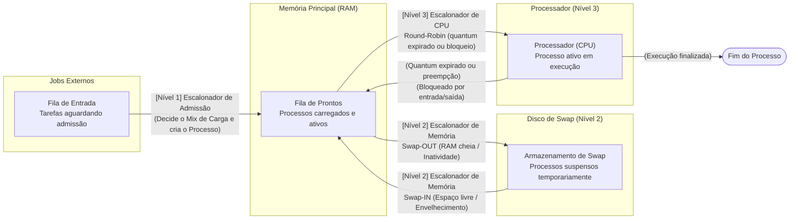

#  Escalonador de Processos em Três Níveis

> Simulação educacional de escalonamento de processos em três níveis, baseada no modelo clássico descrito por **Andrew S. Tanenbaum** em *Sistemas Operacionais Modernos* (Capítulo 2).

---

## Sobre o Projeto

Este projeto implementa, em Java, uma **simulação didática** do escalonamento de processos em três níveis tal como ocorre em sistemas operacionais reais. O objetivo é tornar visível o funcionamento interno do SO ao gerenciar jobs, memória e CPU de forma coordenada, com saída colorida no console para facilitar a compreensão.

A simulação cobre os três escalonadores clássicos:

| Nível | Escalonador           | Responsabilidade                                         |
|-------|-----------------------|----------------------------------------------------------|
| N1    | **Admissão**          | Decide quais jobs da fila de entrada podem entrar na RAM |
| N2    | **Memória (Swap)**    | Gerencia o swap entre RAM e disco para liberar memória   |
| N3    | **CPU (Round-Robin)** | Aloca o processador entre os processos prontos na RAM    |

---

##  Como Executar

### Pré-requisitos

- **Java 21** (JDK 21 ou superior)
- **Apache Maven 3.6+**

Verifique as versões instaladas:

```bash
java -version
mvn -version
```

### Clonando o Repositório

```bash
git clone https://github.com/seu-usuario/escalonador-3-niveis.git
cd escalonador-3-niveis
```

### Compilando o Projeto

```bash
mvn compile
```

### Executando a Simulação

```bash
mvn exec:java -Dexec.mainClass="org.example.Main"
```

> **Dica:** A saída é colorida via códigos ANSI. Certifique-se de usar um terminal que suporte cores (ex: Windows Terminal, PowerShell moderno, qualquer terminal Linux/macOS).

---

## O que Acontece ao Rodar

Ao iniciar, 6 processos são criados e adicionados à fila de entrada:

| Processo | Tipo      | Tempo Total (u.t.) |
|----------|-----------|--------------------|
| P1       | CPU-bound | 6                  |
| P2       | E/S-bound | 4                  |
| P3       | CPU-bound | 8                  |
| P4       | E/S-bound | 6                  |
| P5       | CPU-bound | 4                  |
| P6       | E/S-bound | 8                  |

A cada **ciclo de 2 segundos**, o simulador imprime um relatório colorido como este:

```
==========================================================
  CICLO 01
----------------------------------------------------------
  N1 - ADMISSAO : Admitido: P1[CPU](0/6) (mix 0CPU/0ES -> precisava CPU)
  N2 - MEMORIA  : Sem alteracoes de swap
  N3 - CPU      : Executando: P1[CPU](3/6) (restam 3 u.t.) -> Fim da fila
----------------------------------------------------------
  ESTADO DAS ESTRUTURAS:
  Fila Entrada : P2[E/S](4)  P3[CPU](8)  P4[E/S](6)  P5[CPU](4)  P6[E/S](8)
  Disco Swap   : (vazio)
  Memoria RAM  : P1[CPU](3/6)[i:0]
==========================================================
```

---

## Estrutura do Projeto

```
escalonador-3-niveis/
├── pom.xml                          # Configuração Maven (Java 21, sem dependências externas)
└── src/
    └── main/
        └── java/
            └── org/
                └── example/
                    ├── Main.java                          # Ponto de entrada — cria os jobs e roda o loop
                    ├── Simulador/
                    │   └── Simulador.java                 # Orquestra os três escalonadores por ciclo
                    ├── escalonador/
                    │   ├── EscalonadorAdmissao.java       # Nível 1: controle de admissão na RAM
                    │   ├── EscalonadorMemoria.java        # Nível 2: gerenciamento de swap (RAM ↔ Disco)
                    │   └── EscalonadorCPU.java            # Nível 3: Round-Robin com quantum fixo
                    └── model/
                        ├── Tarefa.java                    # Job ainda não admitido (dados iniciais)
                        ├── Processo.java                  # Processo em execução (estado completo + aging)
                        ├── Estado.java                    # Enum: PRONTO, EXECUTANDO, BLOQUEADO, CONCLUIDO
                        ├── TipoCarga.java                 # Enum: LIMITADO_CPU, LIMITADO_ES
                        ├── FilaDeEntrada.java             # Fila de jobs aguardando admissão
                        ├── FilaDeProntos.java             # Fila de prontos para a CPU (Round-Robin)
                        ├── MemoriaRAM.java                # Memória principal com capacidade limitada
                        ├── ArmazenamentoSwap.java         # Disco de swap (capacidade ilimitada)
                        └── Processador.java               # Abstração da CPU física
```

---

## Arquitetura e Funcionamento

### Ciclo de Vida de um Processo



---

### Nível 1 — EscalonadorAdmissao

**Arquivo:** `src/main/java/org/example/escalonador/EscalonadorAdmissao.java`

Responsável por decidir **qual job da fila de entrada entra na RAM** a cada ciclo.

**Critério de seleção:**
- Verifica se a RAM tem espaço disponível.
- Conta quantos processos CPU-bound e E/S-bound já estão na RAM.
- Prefere admitir o tipo que está **sub-representado** para manter um mix balanceado.
- Se não houver processo do tipo ideal disponível, usa **fallback FIFO**.

---

### Nível 2 — EscalonadorMemoria

**Arquivo:** `src/main/java/org/example/escalonador/EscalonadorMemoria.java`

Gerencia a **troca de processos entre RAM e disco (swap)**.

**Swap-OUT** (RAM → Disco):
- Ativado quando a RAM está cheia e há processos pendentes (na fila ou no disco).
- Escolhe o processo com **maior tempo de inatividade na RAM** (`tempoInativoRAM`).
- O processo removido da RAM também é sincronizado com a fila de prontos.

**Swap-IN** (Disco → RAM):
- Ativado quando há espaço na RAM e processos no disco.
- Prefere trazer o tipo que melhora o **mix CPU/E/S** da RAM.
- Dentro do tipo ideal, prioriza o processo há **mais tempo no disco** (aging anti-starvation).

---

###  Nível 3 — EscalonadorCPU

**Arquivo:** `src/main/java/org/example/escalonador/EscalonadorCPU.java`

Implementa o algoritmo **Round-Robin** com `quantum = 3 unidades de tempo`.

**Comportamento:**
- Desenfileira o próximo processo da fila de prontos.
- Se o processo estiver `BLOQUEADO` (E/S pendente), recoloca-o no final da fila.
- Caso contrário, executa por até `quantum` unidades de tempo.
- Enquanto um processo usa a CPU, os demais **envelhecem** (`envelhecerMemoria` / `incrementarInativoRAM`).
- Ao concluir, o processo é removido da RAM e marcado como `CONCLUIDO`.

---

###  Modelo de Dados

| Classe              | Descrição                                                                          |
|---------------------|------------------------------------------------------------------------------------|
| `Tarefa`            | Job ainda fora do sistema — armazena apenas id, tipo e tempo total necessário.     |
| `Processo`          | Estende a tarefa com estado completo: tempo executado, aging no disco e na RAM.    |
| `Estado`            | Enum: `PRONTO`, `EXECUTANDO`, `BLOQUEADO`, `CONCLUIDO`.                            |
| `TipoCarga`         | Enum: `LIMITADO_CPU` (CPU-bound) ou `LIMITADO_ES` (I/O-bound).                    |
| `MemoriaRAM`        | Lista de processos com capacidade máxima configurável (padrão: **2 slots**).       |
| `ArmazenamentoSwap` | Lista ilimitada que simula o disco de swap.                                        |
| `FilaDeEntrada`     | Fila de jobs aguardando serem admitidos.                                           |
| `FilaDeProntos`     | Fila de processos na RAM prontos para receber tempo de CPU.                        |
| `Processador`       | Abstração da CPU: executa processos e atualiza o tempo executado.                  |

---

## Parâmetros Configuráveis

Os parâmetros da simulação estão definidos como constantes em `Simulador.java`:

| Constante         | Valor Padrão | Descrição                                            |
|-------------------|--------------|------------------------------------------------------|
| `QUANTUM`         | `3`          | Unidades de tempo que cada processo recebe na CPU    |
| `TAMANHO_MEMORIA` | `2`          | Capacidade máxima da RAM (número de processos)       |
| `PAUSA_NIVEL_MS`  | `250`        | Pausa em ms entre a execução de cada nível por ciclo |

> Para experimentar comportamentos diferentes, altere esses valores em `Simulador.java` e recompile.

---

## Referência Bibliográfica

> TANENBAUM, Andrew S. **Sistemas Operacionais Modernos**. 4ª ed. Pearson, 2016.  
> Capítulo 2 — Processos e Threads.

---

## Tecnologias Utilizadas

- **Java 21**
- **Apache Maven** (gerenciamento de build e execução)
- Sem dependências externas — apenas Java puro.

---

## Licença

Este projeto foi desenvolvido para fins **educacionais**. Sinta-se livre para estudar, modificar e distribuir.
